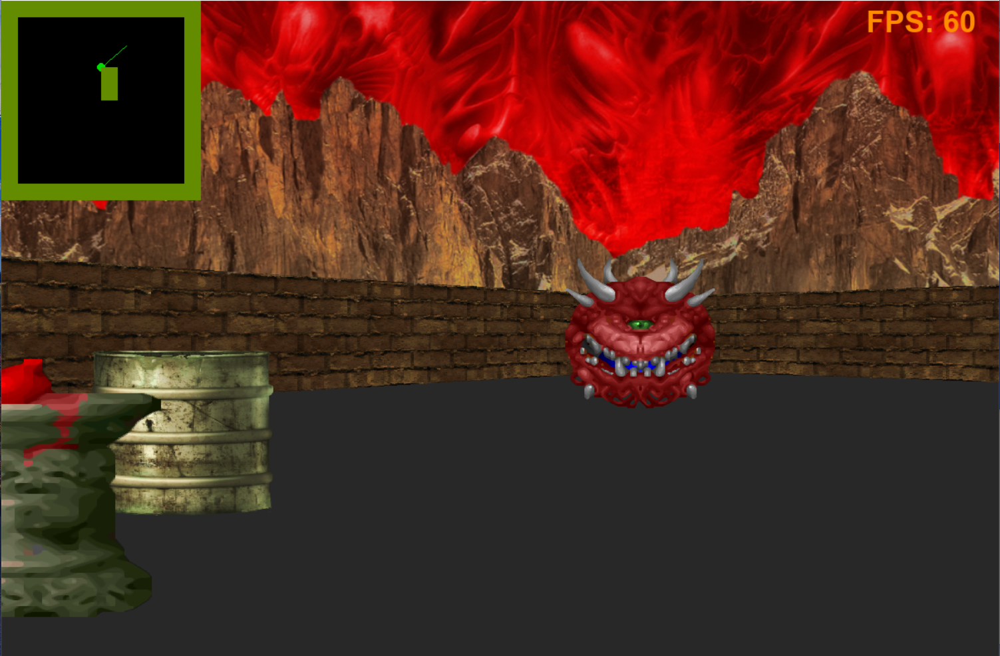

# Raycasting Game Engine

## Overview
This project is a Python-based game engine that utilizes **ray casting** for rendering a pseudo-3D environment. The engine provides the foundation for creating retro-style first-person shooter (FPS) games reminiscent of classic titles like Wolfenstein 3D.

## Key Features

- **2.5D Rendering**: Implements ray casting to simulate a 3D environment using 2D assets.
- **Dynamic Objects**: Supports sprites for dynamic and static objects.
- **Tile-Based World**: The world is constructed using a grid-based map, allowing easy customization of level layouts.
- **Collision Detection** (in development): Simple collision detection for player movement.
- **Extendable**: Easily modifiable to include additional features like textures, lighting, and animations.

## Dependencies

- **Python 3.10+**
- **Pygame**: A library for creating games and rendering graphics.
